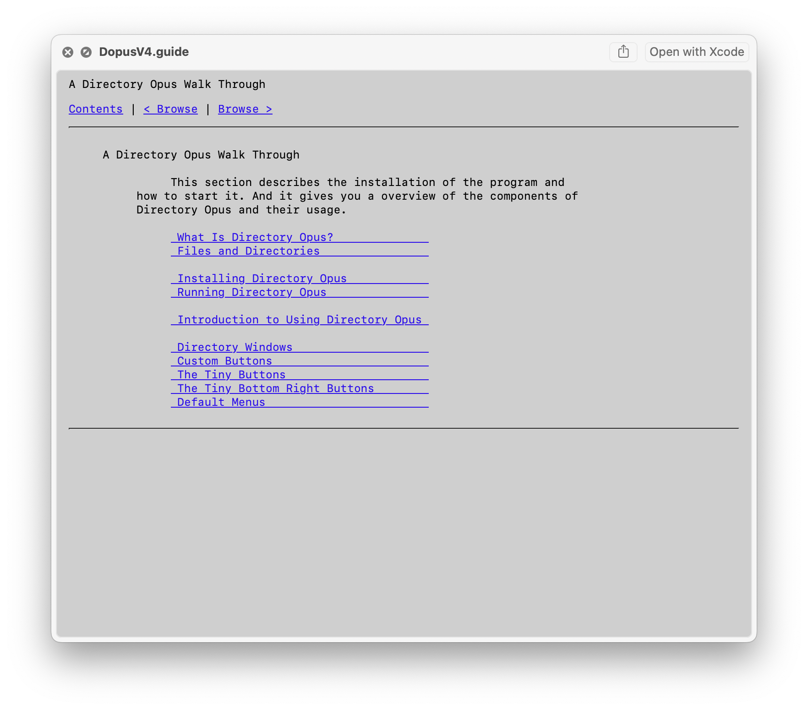

# AmigaGuide

Preview [AmigaGuide](https://wiki.amigaos.net/wiki/AmigaGuide) `.guide` documents in Finder with Quick Look, and open them in a small viewer.



Select a `.guide` file and press Space. If nothing appears, enable the Quick Look extension in System Settings → Extensions, then turn on Amiga Guide under Quick Look.

Conversion uses [GuideML](https://www.unsatisfactorysoftware.co.uk/index.php?pg=guideml) (vendored, with small macOS patches, in `GuideML/`).

DiscMaster has [over 50K AmigaGuide files](https://discmaster.textfiles.com/search?extension=.guide&format=amigaGuide&dedup=dedup) from old Amiga CD-ROMs and disk images—a good place to grab `.guide` documents to try.

## Requirements

- macOS 13.5 or later

## Build

Open `AmigaGuide.xcodeproj` in Xcode, or:

```
xcodebuild -scheme AmigaGuide -configuration Debug -destination 'platform=macOS' build
```

A Debug build also installs a signed copy to `/Applications/Amiga Guide.app` so Launch Services and Quick Look can find the extension.

## Release

Notarize and wrap a stapled DMG:

```
./scripts/notarize.sh
```

Then attach `build/AmigaGuide.dmg` to a GitHub release.

## License

[GNU GPL v3](LICENSE). GuideML is GPL v2 or later; this project ships under GPL v3.
